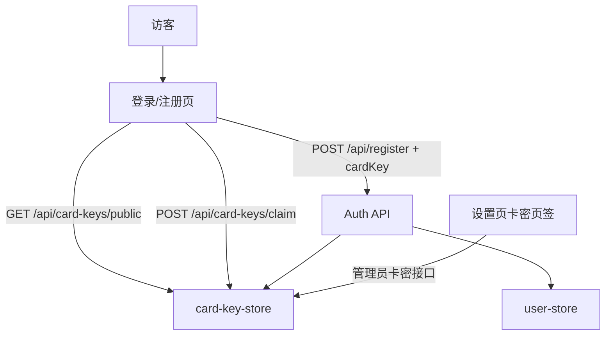

# 时间卡密系统

Feature Name: card-key-system
Updated: 2026-09-30

## Description

注册必须核销一张未使用的时间卡密。核销后按卡密天数设置 User 的 `expiresAt`。超级管理员批量创建时间卡密，并控制注册页是否允许免费领取。领取只返回一张未使用卡密供填入，核销发生在注册成功时。

## Architecture



领取开关关闭时注册页只显示卡密输入框。打开后显示领取按钮；点击后把返回的卡密填入输入框。注册成功才把该卡标记为已使用。

## Components and Interfaces

### 1. `core/src/models/card-key-store.ts`

持久化 `data/card-keys.json`。

- `createCardKeys({ count, days, description })`
- `listCardKeys()`
- `getPublicClaimStatus()`：`{ claimEnabled, stock }`
- `setClaimEnabled(enabled)`
- `claimCardKey()`：领取开关打开时返回首张未使用卡密明文，不核销
- `consumeCardKey(code, userId)`：注册核销，返回天数

卡密格式：16 位大写十六进制。天数必须为正整数。

### 2. 用户到期

`UserRecord` 增加 `expiresAt`。注册时 `expiresAt = Date.now() + days * 86400000`。登录与鉴权对普通用户检查到期；超级管理员不检查。

### 3. HTTP 接口

| 方法 | 路径 | 鉴权 | 说明 |
| --- | --- | --- | --- |
| GET | `/api/card-keys/public` | 公开 | 领取开关与库存 |
| POST | `/api/card-keys/claim` | 公开 | 领取一张未使用时间卡密 |
| POST | `/api/register` | 公开 | 增加必填 `cardKey` |
| GET | `/api/admin/card-keys` | admin | 列表、开关、库存 |
| POST | `/api/admin/card-keys` | admin | 批量创建 |
| PUT | `/api/admin/card-keys/claim-enabled` | admin | 更新领取开关 |

### 4. 前端

- `Login.vue`：注册增加卡密输入；领取开启时显示领取按钮，成功后自动填入
- `Settings.vue`：管理员「卡密」页签，开关、库存、创建、列表

## Data Models

```json
{
  "claimEnabled": false,
  "nextId": 2,
  "keys": [
    {
      "id": "k_1",
      "code": "92F446FA0EF67A4A",
      "days": 300,
      "description": "300天卡",
      "used": false,
      "usedBy": "",
      "usedAt": 0,
      "createdAt": 0
    }
  ]
}
```

## Correctness Properties

- 每张卡密最多被成功注册核销一次
- 用户名或密码失败时卡密保持未使用
- 领取不核销；同一张未使用卡密可被多次领取，先完成注册者核销成功
- 到期用户无法登录

## Error Handling

| 场景 | HTTP | 文案 |
| --- | --- | --- |
| 未填卡密 | 400 | 请输入卡密 |
| 卡密无效或已使用 | 400 | 卡密无效或已使用 |
| 领取未开启 | 403 | 卡密领取未开启 |
| 库存为 0 | 409 | 暂无可领取卡密 |
| 账号到期 | 403 | 账号已过期 |

## Test Strategy

覆盖：无卡密拒绝注册；有效时间卡密设置 `expiresAt`；重复核销失败；领取开关关闭拒绝领取；领取返回未使用卡密且不核销。
