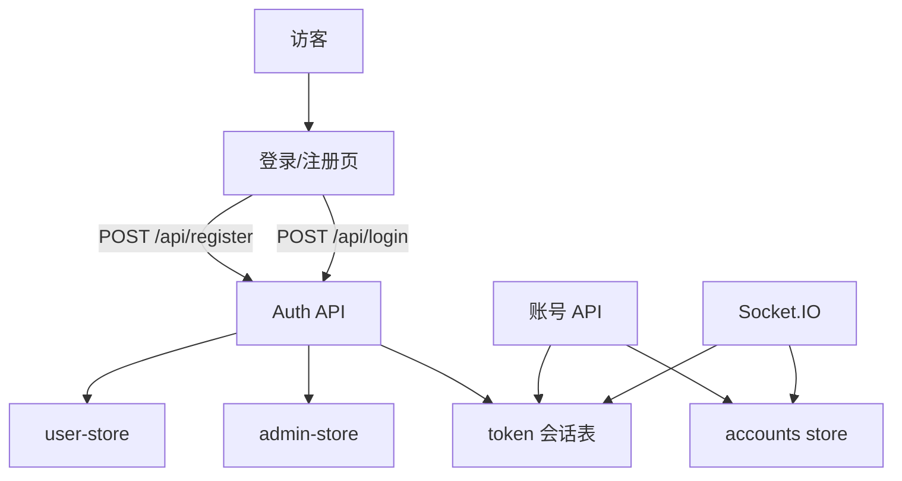

# 多用户系统与注册额度

Feature Name: user-system
Updated: 2026-09-30

## Description

在现有单超级管理员面板上增加公开注册的普通用户。每个注册用户默认 Quota 为 99，用于限制该用户可绑定的游戏账号数量。超级管理员额度不受限，可管理全部用户。游戏账号按 `ownerId` 归属用户，接口与实时推送按登录身份过滤。

## Architecture



登录与注册走同一套用户名规则。登录先匹配超级管理员，再匹配普通用户。成功后签发 token，并在内存会话表中绑定 `userId`、`role`、`username`。后续 HTTP 与 Socket.IO 均从会话表取身份，再按 `ownerId` 过滤游戏账号。

## Components and Interfaces

### 1. `core/src/models/user-store.ts`

持久化 `data/users.json`，提供注册、校验、改密、列用户、改额度、启用/禁用。

公开方法：

- `registerUser(username, password)`：创建 `role=user`、`quota=99`、`enabled=true` 的用户
- `validateUser(username, password, ip)`：校验普通用户登录
- `getPublicUser(userId)`：返回不含密码的用户信息与已用额度
- `listUsers()`：管理员列出全部普通用户
- `updateQuota(userId, quota)`：管理员改额度
- `setUserEnabled(userId, enabled)`：管理员启用/禁用
- `changeUserPassword(userId, oldPassword, newPassword)`
- `countOwnedAccounts(userId)`：统计该用户已绑定游戏账号数
- `usernameExists(username)`：用户名是否已被管理员或普通用户占用

用户名规则与登录页一致：3–32 位，仅字母数字下划线。密码强度复用 `auth-security.validatePasswordStrength`。

### 2. 会话与鉴权

`AdminContext.tokens` 从 `Set<string>` 升级为 `Map<string, Session>`：

```ts
interface Session {
  token: string;
  userId: string;
  username: string;
  role: 'admin' | 'user';
}
```

超级管理员 `userId` 固定为 `admin`。`createAuthRequired` 将会话写入 `req.auth`。`/api/register` 与 `/api/login`、`/api/game-version` 保持免鉴权。

Socket.IO 握手校验 token 后写入 `socket.data.session`。订阅账号时，普通用户只能订阅自己的 `ownerId` 账号；订阅 `all` 时只加入自己名下账号房间。

### 3. HTTP 接口

| 方法 | 路径 | 鉴权 | 说明 |
| --- | --- | --- | --- |
| POST | `/api/register` | 公开 | 注册，成功返回 token、role、quota=99 |
| POST | `/api/login` | 公开 | 管理员或普通用户登录 |
| GET | `/api/user/me` | 登录 | 当前用户信息、quota、usedQuota |
| POST | `/api/user/change-password` | 登录 | 改自己的密码并清除该用户全部会话 |
| GET | `/api/admin/users` | admin | 用户列表 |
| PUT | `/api/admin/users/:id/quota` | admin | 更新额度，新值必须 >= 已绑定账号数 |
| PUT | `/api/admin/users/:id/enabled` | admin | 启用或禁用，禁用时清除该用户全部会话 |

新增游戏账号时：

1. 写入 `ownerId = session.userId`
2. 若 `role=user` 且 `usedQuota >= quota`，返回 403，错误文案为额度不足

列表、删除、启停、日志、状态均先按会话过滤可见账号。

### 4. 前端

- `Login.vue`：登录/注册切换；注册调用 `/api/register`
- `stores/user.ts`：`role` 支持 `admin | user`，保存 `quota`、`usedQuota`
- 侧栏展示角色、额度（`usedQuota / quota`）；管理员显示「不限」
- 新增 `UsersManage.vue` 或设置页「用户管理」页签：仅 `role=admin` 可见，可改额度、禁用
- 添加游戏账号失败时展示额度不足提示

## Data Models

### `data/users.json`

```json
{
  "users": [
    {
      "id": "u_1",
      "username": "alice",
      "password": "salt:hash",
      "role": "user",
      "quota": 99,
      "enabled": true,
      "createdAt": 0,
      "updatedAt": 0
    }
  ],
  "nextId": 2
}
```

### 游戏账号

`Account` 增加 `ownerId: string`。缺省或空值在 `normalizeAccount` 时写为 `admin`，保证旧数据归属超级管理员。

### 登录响应

```json
{
  "ok": true,
  "data": {
    "token": "...",
    "role": "user",
    "user": { "id": "u_1", "username": "alice" },
    "quota": 99,
    "usedQuota": 0,
    "mustChangePassword": false
  }
}
```

常量 `DEFAULT_USER_QUOTA = 99` 放在 `user-store.ts`。

## Correctness Properties

- 每个用户名在超级管理员与普通用户集合中唯一
- 新注册用户 `quota` 恒为 99，`role` 恒为 `user`
- 普通用户已绑定游戏账号数小于等于其 `quota`
- 普通用户接口与推送只涉及 `ownerId` 等于自身 `userId` 的账号
- 超级管理员添加游戏账号不检查额度
- 禁用用户后，其全部 Session Token 立即失效
- 额度更新值大于等于该用户当前已绑定账号数

## Error Handling

| 场景 | HTTP | 返回 |
| --- | --- | --- |
| 用户名已存在 | 409 | `{ ok: false, error: '用户名已被使用' }` |
| 用户名或密码格式不合法 | 400 | 明确字段错误 |
| 登录失败 | 401/423/429 | 沿用现有锁定与频率限制 |
| 用户已禁用 | 403 | `{ ok: false, error: '账号已被禁用' }` |
| 额度用尽仍新增账号 | 403 | `{ ok: false, error: '额度不足，无法添加更多游戏账号' }` |
| 额度改到小于已用数量 | 400 | `{ ok: false, error: '额度不能小于已绑定账号数' }` |
| 普通用户访问管理员接口 | 403 | `{ ok: false, error: '无权限' }` |
| 访问他人游戏账号 | 404 | `{ ok: false, error: 'Account not found' }` |

登录失败计数对管理员与每个普通用户名分别记录，IP 频率限制保持全局。

## Test Strategy

后端使用现有 `node --test`：

- 注册成功后 `quota === 99`
- 重复用户名与非法用户名被拒绝
- 用户添加第 100 个游戏账号失败，第 99 个成功
- 管理员添加账号不受额度限制
- 用户只能列出自己的账号；旧账号无 `ownerId` 时归管理员
- 禁用用户后原 token 访问返回 401
- 管理员把额度改到小于已用数量失败

前端：登录页可切换注册；注册成功进入面板；侧栏显示 `0 / 99`。

## References

[^1]: (Filename) - 现有管理员存储 `core/src/models/admin-store.ts`
[^2]: (Filename) - 现有登录鉴权 `core/src/controllers/admin/auth-routes.ts`
[^3]: (Filename) - 游戏账号存储 `core/src/models/store/accounts.ts`
[^4]: (Filename) - 登录页 `web/src/views/Login.vue`
